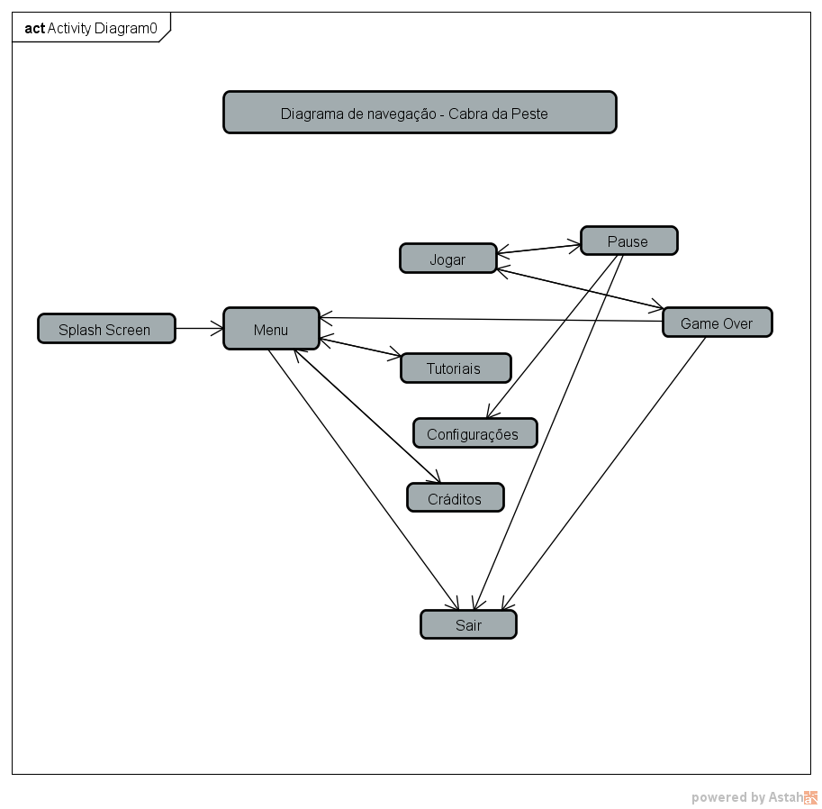

# CabraDaPeste
Projeto de game da disciplina de estágio 1

## História
  Bredisvaldo Ysmite desde de bacurim era um garoto corajoso e determinado que sempre ajudava sua família e vizinhos. Chegando a sua adolecência teve em mente ir lutar contra as adversidades que assolam o nordeste brasileiro, então vestiu seu traje e seguiu sertão a fora para guerrar contra as adversidades.

## Objetivos
  Destruir as adversidades que destrói o nordeste brasileiro. Ex.: Fome, sede, miséria.
  

## Diagrama de navegação
 
 
 

## Objetivos Específicos
  Conquistar elementos que são contrários a adversidade. Ex.: alimentos são contrários a fome; água é contrário a sede.
  

##  Regras do Jogo com Sistema de Pontuação
  Cada elemento conquistado tem um nível de pontuação, e o jogador terá que somar os elementos conquistados até somar no 3000pts até o fim do percuso, a pontuação será exibida em uma barra no canto superior direito. O jogador também pode perder pontos, caso pegue os elementos da adversidade, dos quais terão valores randômicos(5...500).
  
  1. $$$ = 20pts
  2. Milho = 25pts
  3. Arroz = 40pts
  4. Água = 50pts
  

## Sistema de Vidas
  Inicia com 3 vidas, e o limite máximo de vidas é 5. A vidas são feijões mulatinho que estão no percurso traçado.
  
## Como o Jogo Acaba
  O jogo encerra quando o Bredisvaldo derrotar todas as adversidades, das quais serão dívidas em fases.
  
## Mapa de Atividades
  https://trello.com/b/lWRz24M6/cabra-da-peste
