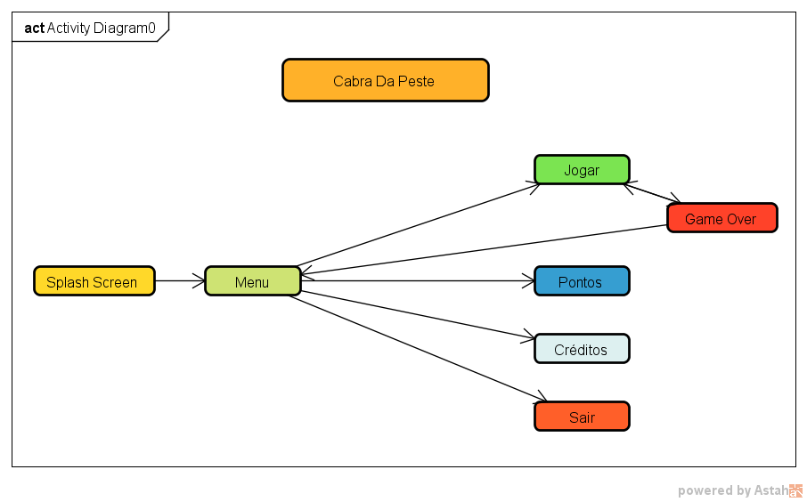

# CabraDaPeste
Projeto de game da disciplina de estágio 1

## História
  Bredisvaldo Ysmite desde de bacurim era um garoto corajoso e determinado que sempre ajudava sua família e vizinhos. Chegando a sua adolescência teve em mente ir lutar contra as adversidades que assolam o nordeste brasileiro, então vestiu seu traje e seguiu sertão a fora para guerrear contra as adversidades.

## Objetivos
  Destruir as adversidades que destrói o nordeste brasileiro. Ex.: fome, seca, pobreza.
  

## Diagrama de navegação
 
 
 

##  Regras do Jogo com Sistema de Pontuação
  O jogador terá que matar quantos inimigos puder, quanto mais inimigos mortos irá pontuar mais. Cada inimigo morto equivale 1 ponto.
  
  1. Inimigo: 1 ponto
  

## Sistema de Vidas
  O jogador terá um limite de 3 vidas.
  
## Como o Jogo Acaba
  O jogo encerra quando o Bredisvaldo perder todas suas vidas.
  
## Mapa de Atividades
  https://trello.com/b/lWRz24M6/cabra-da-peste
  
## Estórias de Usuário
  https://trello.com/b/4ETPw3l1/est%C3%B3rias-de-usu%C3%A1rio-cabra-da-peste
